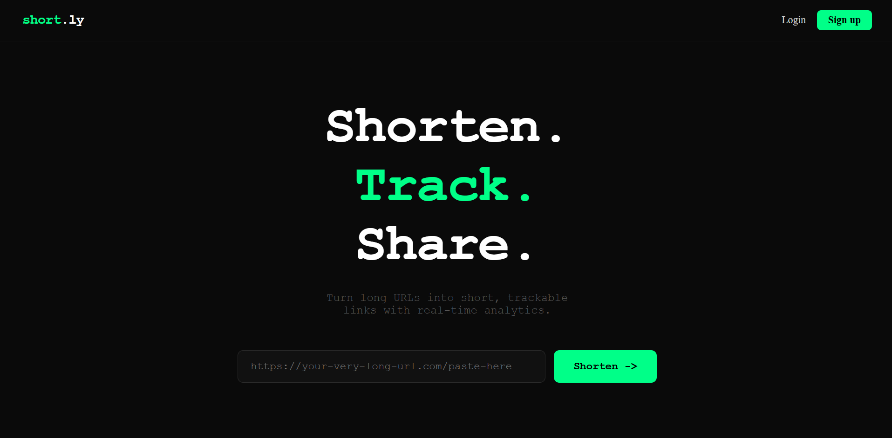
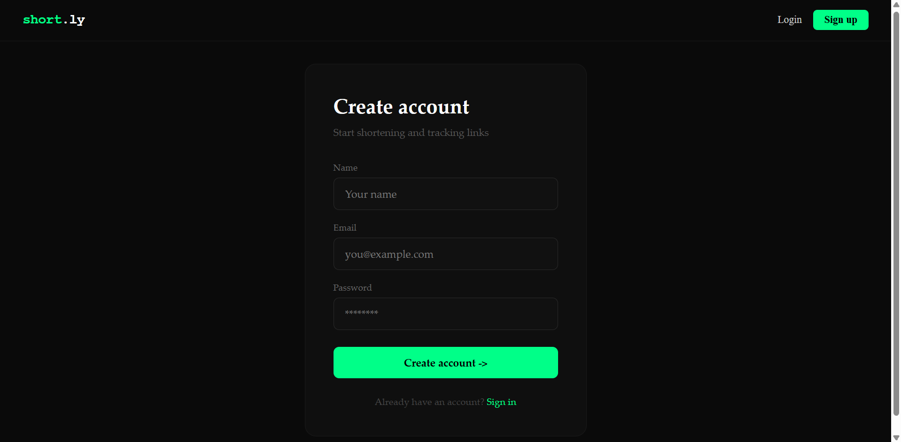
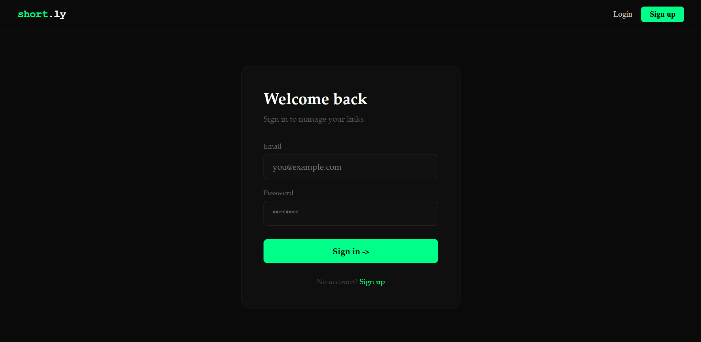
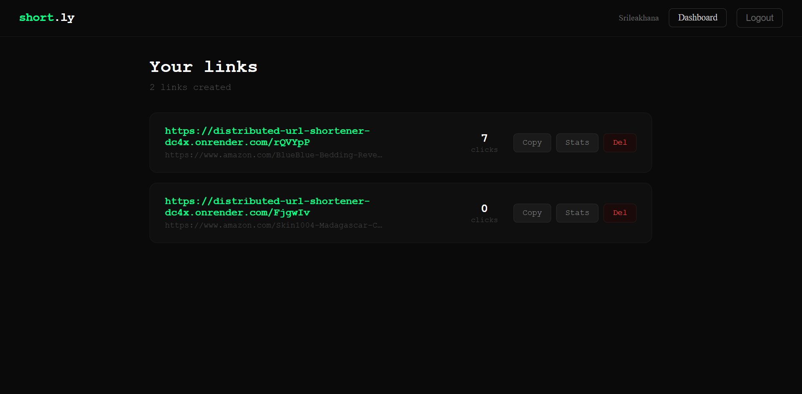
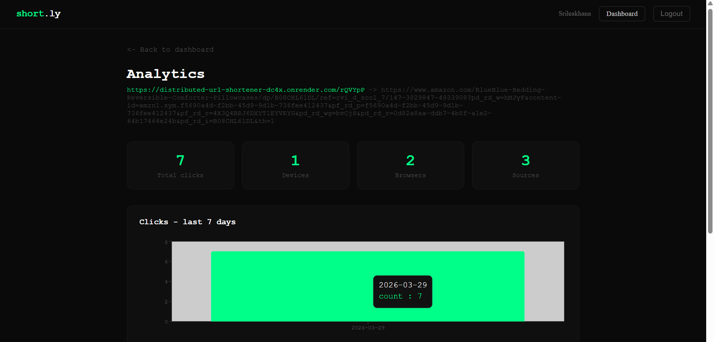
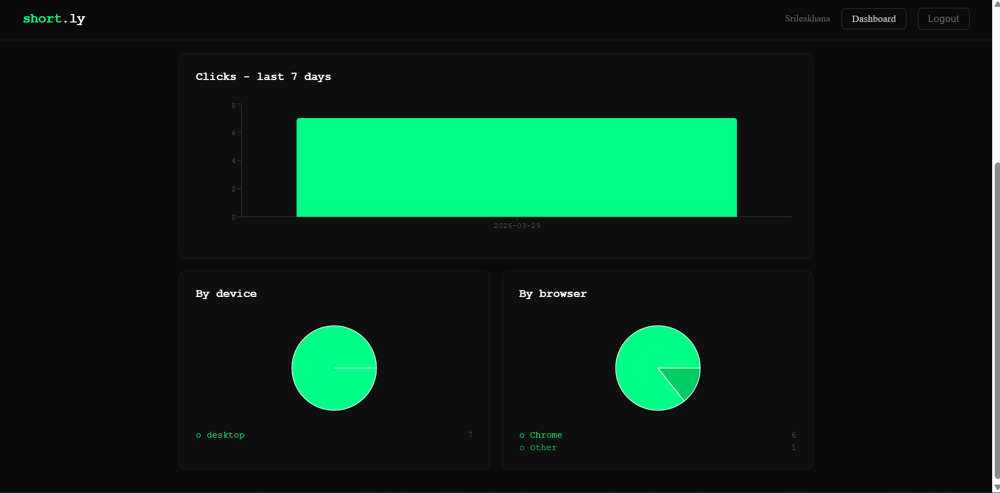

# Distributed URL Shortener

A full-stack URL shortening platform built with React, Node.js, Express, MongoDB, and Redis. It supports authenticated link management, fast redirects with caching, and analytics for tracking link performance.


## Live Demo

- Website: [https://distributed-url-shortener-kappa.vercel.app](https://distributed-url-shortener-kappa.vercel.app)

## Overview

This project allows users to:

- create short links from long URLs
- manage links from a personal dashboard
- view click analytics for each shortened URL
- use custom aliases and optional expiration settings
- benefit from Redis-backed redirect performance

## Why This Project

This project was built to explore the core ideas behind products like Bitly and TinyURL:

- turning long URLs into compact, shareable links
- handling redirect-heavy traffic efficiently
- adding authentication and per-user dashboards
- caching hot paths to reduce database reads
- collecting analytics without slowing down the redirect experience

## Features

- Secure user registration and login with JWT authentication
- URL shortening with generated short codes
- Optional custom aliases for memorable links
- Optional expiration for temporary links
- Fast redirect flow with Redis caching
- Protected dashboard for user-owned links
- Click analytics by device, browser, OS, and referrer
- Rate limiting for auth and shortening endpoints
- Backend test coverage with 32 passing Jest/Supertest tests

## Product Highlights

- Authenticated users can create, manage, copy, and delete short links from a personal dashboard
- Redirect traffic is optimized using Redis so frequently visited links avoid repeated database lookups
- Analytics give quick visibility into total clicks, device mix, browser mix, and source breakdowns
- The application is deployed as a split architecture: React frontend on Vercel and Express API on Render

## Tech Stack

| Layer | Tools |
| --- | --- |
| Frontend | React, React Router, Axios, Recharts |
| Backend | Node.js, Express |
| Database | MongoDB Atlas |
| Cache | Redis |
| Authentication | JWT, bcryptjs |
| Deployment | Vercel, Render |
| Testing | Jest, Supertest |

## Architecture

```text
Browser
  |
  v
React frontend (Vercel)
  |
  v
Express API (Render)
  |             \
  |              \
  v               v
MongoDB         Redis
(primary data)  (cache)
```

### Redirect flow

1. User opens a short URL
2. Backend checks Redis cache first
3. On cache hit, it redirects immediately
4. On cache miss, it queries MongoDB
5. The result is cached for future requests
6. Click analytics are tracked asynchronously

## Project Structure

```text
distributed-url-shortener/
|-- client/
|   |-- public/
|   |-- src/
|   |   |-- components/
|   |   |-- hooks/
|   |   |-- pages/
|   |   `-- utils/
|   `-- package.json
|-- server/
|   |-- src/
|   |   |-- app.js
|   |   |-- index.js
|   |   |-- config/
|   |   |-- controllers/
|   |   |-- middleware/
|   |   |-- models/
|   |   |-- routes/
|   |   |-- services/
|   |   `-- tests/
|   `-- package.json
|-- .gitignore
`-- README.md
```

## Screenshots

### Home



### Sign Up



### Login



### Dashboard



### Analytics





## Local Setup

### Prerequisites

- Node.js 18+
- MongoDB connection string
- Redis connection string

### 1. Clone the repository

```bash
git clone https://github.com/SrileakhanaMangapathi/distributed-url-shortener.git
cd distributed-url-shortener
```

### 2. Configure the backend

Create `server/.env`:

```env
PORT=5000
NODE_ENV=development
MONGO_URL=your_mongodb_connection_string
REDIS_URL=your_redis_connection_string
JWT_SECRET=your_jwt_secret
JWT_EXPIRES_IN=7d
BASE_URL=http://localhost:5000
CLIENT_URL=http://localhost:3000
```

Install and run the backend:

```bash
cd server
npm install
npm run dev
```

### 3. Run the frontend

```bash
cd client
npm install
npm start
```

If you want the frontend to call a separate backend explicitly, create a client `.env` with:

```env
REACT_APP_API_URL=http://localhost:5000/api
```

## Testing

Run backend tests:

```bash
cd server
npm test
```

Current backend test result:

```text
Test Suites: 3 passed, 3 total
Tests:       32 passed, 32 total
```

The backend tests cover:

- short-code generation and validation
- auth flows
- URL shortening routes
- redirect behavior
- protected route access

## API Endpoints

### Auth

- `POST /api/auth/register`
- `POST /api/auth/login`
- `GET /api/auth/me`

### URLs

- `POST /api/urls/shorten`
- `GET /:shortCode`
- `GET /api/urls`
- `DELETE /api/urls/:id`

### Analytics

- `GET /api/analytics/:shortCode`

## Deployment

### Frontend on Vercel

- Root directory: `client`
- Environment variable:

```env
REACT_APP_API_URL=https://distributed-url-shortener-dc4x.onrender.com/api
```

### Backend on Render

- Root directory: `server`
- Build command:

```bash
npm install
```

- Start command:

```bash
node src/index.js
```

- Environment variables:

```env
MONGO_URL=your_mongodb_connection_string
REDIS_URL=your_redis_connection_string
JWT_SECRET=your_jwt_secret
BASE_URL=https://distributed-url-shortener-dc4x.onrender.com
CLIENT_URL=https://distributed-url-shortener-kappa.vercel.app
```

## Key Implementation Notes

- Short links are generated using the configured `BASE_URL`
- The backend normalizes frontend origins for CORS handling
- Cached redirects reduce repeated MongoDB lookups
- Analytics tracking is designed to avoid blocking the redirect path

## Challenges Solved

- Fixed PowerShell/Jest execution issues locally by running tests in-band
- Separated app creation from server startup so backend tests can run without opening real services
- Adapted frontend/backend deployment for Vercel + Render instead of assuming a single-host deployment
- Resolved CORS issues caused by exact-origin mismatches and trailing slash differences
- Corrected production short-link generation by aligning `BASE_URL` with the actual Render service URL

## Future Improvements

- QR code generation for short links
- Better admin/dashboard filtering
- Background jobs for analytics processing
- Custom branded domains
- Real-time analytics updates
- Improved error messaging on the frontend

## License

MIT
